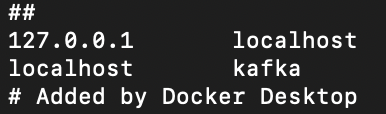
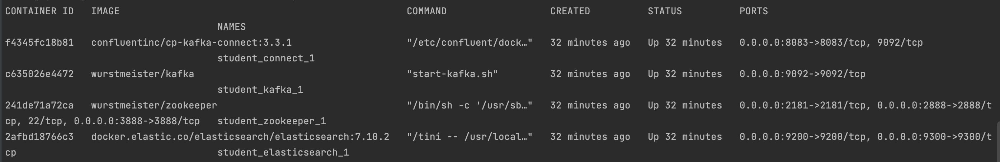
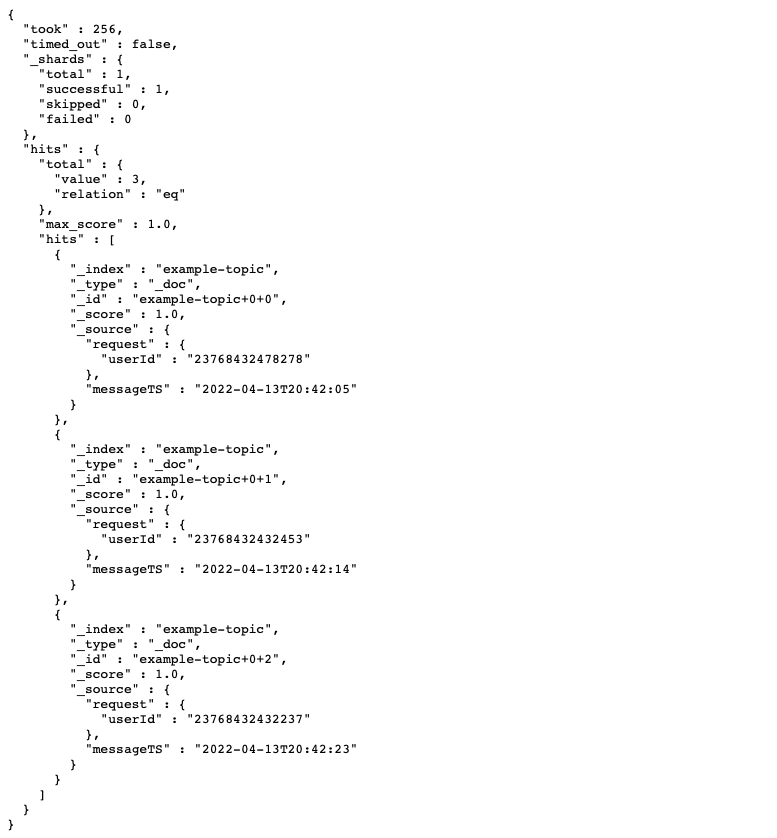
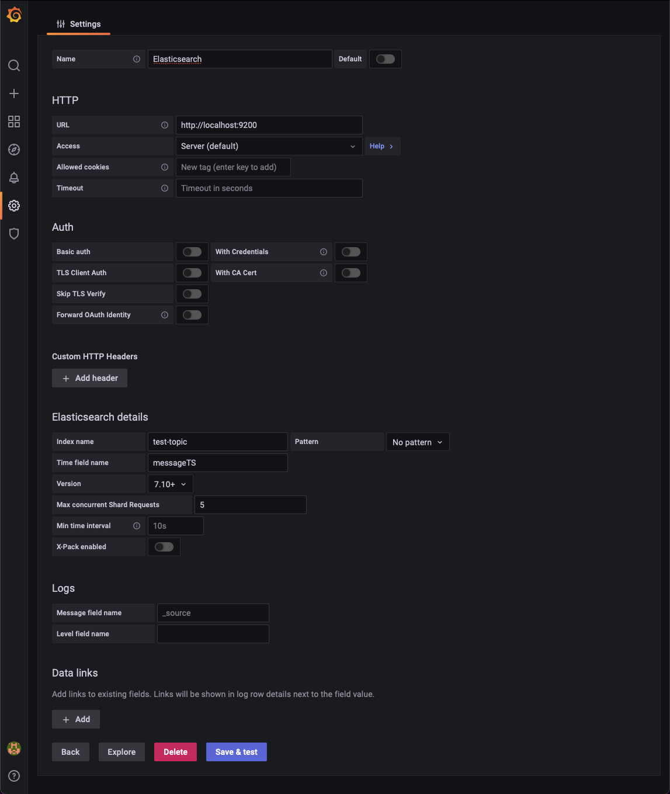

# Kafka | Kafka-connect | Elasticsearch | Sink Connector

We will use docker and docker-compose to run this project. Increase your memory allocation to 6-8GB just to be safe.

## Change /etc/hosts file for kafka

Since in docker-compose.yml file, the environment variable “KAFKA_ADVERTISED_HOST_NAME” is set to “kafka”, you need to do a small change in your /etc/hosts file 

## Run startup.sh

Simply run **startup.sh** file to make everything work. Give it some time to initialize, it might take a while.

After everything started up, you should see these containers running when you type **docker ps**:

## Event stored in elasticsearch

Finally, let’s check if the kafka connector worked as we intended.

Open your browser and go to  [http://localhost:9200/test-topic/_search?pretty](http://localhost:9200/test-topic/_search?pretty)

You should see something like this:

Now you are ready to use your elasticsearch as datasource. Just use the [http://localhost:9200](http://localhost:9200/test-topic/_search?pretty) port as the URL and you should be good to go.

## Bonus

This part is optional, now you are ready to visualize the messages with Grafana by adding Elasticsearch as the datasource. 

You need to keep in mind that your kafka topic name corresponds to index name in elasticsearch.

